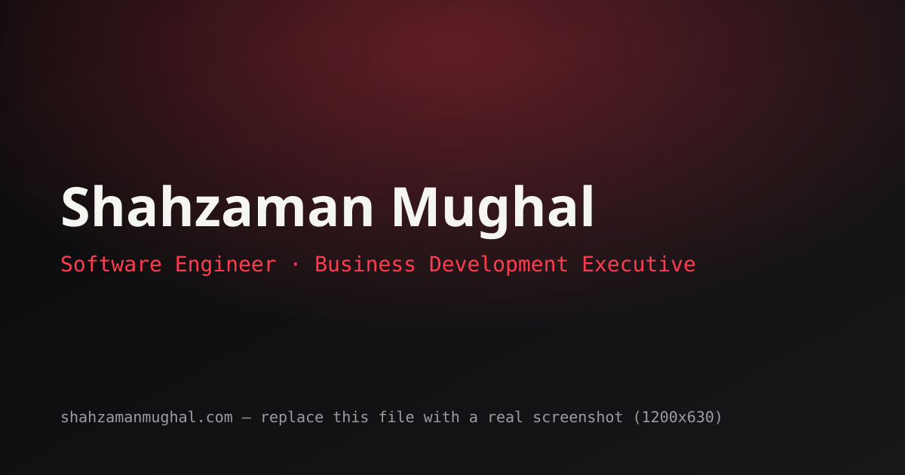

# Shahzaman Mughal — Personal Portfolio

A premium, animated personal portfolio built with React, TypeScript, Tailwind
CSS, and Framer Motion. Showcases education, experience, skills, projects,
and a live GitHub activity feed for **Shahzaman Mughal** — Software
Engineering student at UMT Sialkot and Business Development Executive at
Asamar Surgical.

**Live demo:** _add your deployed URL here once live_


_Screenshot placeholder — replace `public/og-cover.svg` with a real screenshot once deployed._

---

## ✨ Features

- Modern black / white / scalpel-red dark theme with a blueprint-grid motif
- Animated hero with role-switching typewriter effect
- Scroll-triggered reveal animations throughout (Framer Motion)
- Custom cursor, scroll progress bar, and back-to-top button
- Glassmorphism cards with cursor-reactive tilt and glow
- Animated skill bars and counters
- Fully responsive, accessible (visible focus states, reduced-motion support)
- 15 content sections: Hero, About, Education, Experience, Skills, Projects,
  Certifications, Achievements, Journey, Services, Technologies, GitHub
  Stats, Testimonials, Contact, Footer
- Contact form wired for [EmailJS](https://www.emailjs.com) (free tier)
- SEO-ready: meta tags, Open Graph, `robots.txt`, `sitemap.xml`
- Custom 404 page

## 🧱 Tech Stack

| Layer          | Choice                                   |
| -------------- | ----------------------------------------- |
| Framework      | React 18 + Vite                          |
| Language       | TypeScript                               |
| Styling        | Tailwind CSS                             |
| Animation      | Framer Motion, GSAP                      |
| Smooth scroll  | Lenis                                    |
| Icons          | React Icons                              |
| Routing        | React Router                             |
| Contact form   | EmailJS                                  |

## 📁 Project Structure

```
portfolio/
├── public/                  # Static assets served as-is
│   ├── images/
│   │   ├── profile/         # Your headshot goes here
│   │   ├── projects/        # Project screenshots
│   │   ├── certificates/    # Certificate images
│   │   └── gallery/         # Optional extra photos
│   ├── favicon.svg
│   ├── og-cover.svg         # Social share preview image
│   ├── robots.txt
│   └── sitemap.xml
├── src/
│   ├── components/
│   │   ├── layout/           # Navbar, Footer, cursor, loading screen, etc.
│   │   ├── sections/         # One file per homepage section
│   │   └── ui/                # Reusable Button, Card, Badge, SkillBar...
│   ├── data/                  # ALL editable content lives here
│   ├── hooks/                 # useLenis, useCountUp, useActiveSection...
│   ├── pages/                  # Home.tsx, NotFound.tsx
│   ├── styles/index.css        # Tailwind entry + global styles
│   ├── App.tsx
│   └── main.tsx
├── index.html
├── tailwind.config.js
├── vite.config.ts
├── package.json
└── DEPLOYMENT_GUIDE.md       # Full beginner-friendly deployment walkthrough
```

## ✏️ Editing Your Content

You should almost never need to touch component code to update content —
everything lives in `src/data/`:

| File                    | What it controls                                 |
| ------------------------ | ------------------------------------------------- |
| `src/data/site.ts`       | Name, roles, bio, contact info, social links      |
| `src/data/education.ts`  | Education timeline                                |
| `src/data/experience.ts` | Work experience cards                             |
| `src/data/skills.ts`     | Technical & business skills                       |
| `src/data/projects.ts`   | Project cards                                     |
| `src/data/misc.ts`       | Certifications, achievements, services, tech, testimonials, journey |

To add real images, drop files into the matching `public/images/*` folder
and update the `image` path in the relevant data file.

## 🚀 Quick Start

```bash
npm install
npm run dev
```

Then open `http://localhost:5173`.

**New to all this?** Read `DEPLOYMENT_GUIDE.md` — it assumes zero prior
experience and walks through every tool, command, and step from an empty
computer to a live website.

## 🔧 Configuration Checklist

Before going live, update these placeholders:

- [ ] `src/data/site.ts` — email, phone, resume URL, social links, map embed
- [ ] `public/resume.pdf` — add your actual CV (referenced by the "Download CV" button)
- [ ] `src/components/sections/Contact.tsx` — EmailJS Service ID, Template ID, Public Key
- [ ] `src/components/sections/GithubStats.tsx` — confirm your GitHub username resolves correctly
- [ ] `public/images/profile/placeholder.svg` — replace with a real photo
- [ ] `public/images/projects/*` — replace with real project screenshots
- [ ] `public/images/certificates/*` — replace with real certificates
- [ ] `index.html` — update `canonical` and `og:url` once you have a domain
- [ ] `public/sitemap.xml` / `public/robots.txt` — update the domain

## 📦 Available Scripts

| Command           | Description                          |
| ------------------ | ------------------------------------- |
| `npm run dev`       | Start local dev server with HMR       |
| `npm run build`     | Type-check and build for production   |
| `npm run preview`   | Preview the production build locally  |
| `npm run lint`      | Run ESLint                            |

## 🌐 Deployment

See **`DEPLOYMENT_GUIDE.md`** for a full, beginner-level walkthrough covering
GitHub Pages, Vercel, and Netlify.

## 📄 License

This project is personal property of Shahzaman Mughal. Feel free to use the
code structure as a learning reference; please don't republish the content
as your own.
